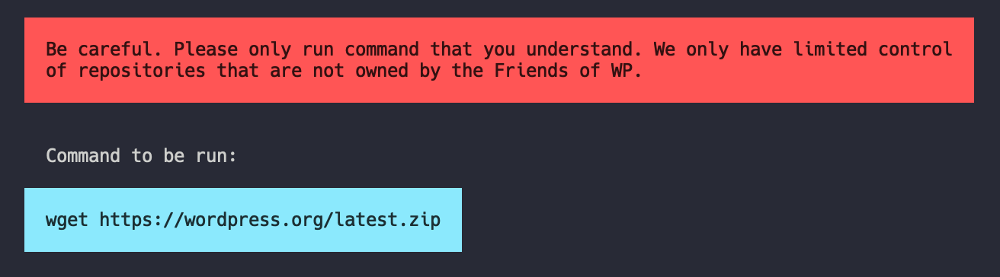

# Creating your own command for the Developer CLI

The CLI tool was designed from the beginning to be very easy to add new functionalities without touching the core. Also, it should be possible to add very simple commands without programming. 

We also decided to develop the project as open source software, but to make it possible to connect non-public commands to the system anyway.

## Simple Commands

By simple commands, we mean commands that could be called on the command line without any parameters. For this kind of commands, we have thought about something special. It is possible to specify a GitHub account when configuring our tool. 

If you want to know more about this you should have a look at the [`commands:gist` extension](https://github.com/friends-of-wp/wp-dev-cli-ext-commands-gist). 

## Complex Commands

