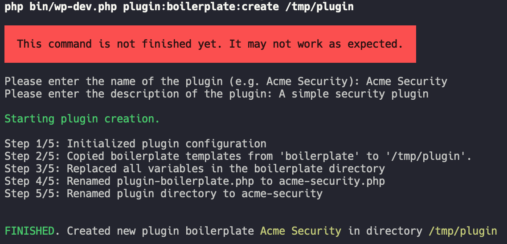

# `plugin:boilerplate:create`

## Usage

The usage of the boilerplate creation command is very easy. As the only parameter the plugin output directory is needed. All other configuration is done via the creation process starting afterwards.

```shell
./wp-dev.phar plugin:boilerplate:create /path/to/plugin/plugin-name
```

## How to create individual steps

It is possible to add individual steps to the boilerplate creation process. This is done via the config yaml file that can be handed over via the CLI parameter `-c`.

````shell
./wp-dev.phar plugin:boilerplate:create /path/to/plugin/plugin-name -c my-default-config.yml
````




The config file should have all the steps in there. All those steps will be processes in the order in that list. 

```yaml
steps:
  - \FriendsOfWp\DeveloperCli\Boilerplate\Step\InitializeStep
  - \FriendsOfWp\DeveloperCli\Boilerplate\Step\CopyTemplatesStep
  - \FriendsOfWp\DeveloperCli\Boilerplate\Step\ReplacingPlaceholdersStep
  - \FriendsOfWp\DeveloperCli\Boilerplate\Step\RenameMasterFileStep
  - \FriendsOfWp\DeveloperCli\Boilerplate\Step\RenamePluginDirStep
```

## How to pre-define parameters
When a custom config file is used it is possible to predefine the answers of some questions in the creation workflow. This helps for example if some answers are "always" the same like author or license. 

```yaml
parameters:
  core_plugin_name: "Acme Security"
  core_plugin_description: "This is the description for the Acme Studios Security plugin."
  core_plugin_version: "1.0.0"

  core_plugin_author_name: Nils langner
  core_plugin_author_email: nils.langner@startwind.io
```

## Todos

- Create settings configuration ([RFC-FWP-01](https://github.com/friends-of-wp/rfc-fwp-01-settings))
- Create empty plugin admin pages
- Add author to plugin questions
- Select license
- Select menu images
- Extend config file to prefill "questions" (like author).

