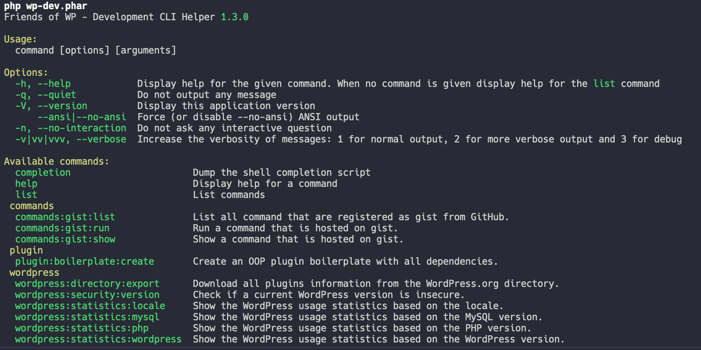

# Friends of WP - WordPress Developer CLI

[](https://scrutinizer-ci.com/g/friends-of-wp/wp-dev-cli/?branch=develop)

This command line tool helps WordPress developers with their daily work. It is maintained by the [Friends of WP](https://www.friendsofwp.com) and published unter the MIT license.

## Why not using the official WordPress CLI?

There is already a perfect [WordPress CLI](https://wp-cli.org/) out there. So why did we decide to implement one on our own? The WP CLI is build to manage your installed WordPress without using a browser. It helps with the daily work. 

Our new WP DEV CLI is built for developers. It provides all needed tools to create plugins, themes and other elements. So this CLI is used before the go live and the WP CLI afterwards. 

Being not the tool running on the server has one big advantage. We do not have to support old PHP versions ([> 74 % of all WordPress installations use PHP 7.4 and lower](https://github.com/friends-of-wp/wp-dev-cli-ext-statistics)). That means the DEV CLI can use all features PHP 8 has in store. 

## Usage

Download the latest version of our PHAR archive and give it afterwards rights to be executed.

```shell
wget https://github.com/friends-of-wp/wp-dev-cli/releases/latest/download/wp-dev.phar
chmod +x wp-dev.phar
```

To check if the CLI tool is ready to use type:

```shell
./wp-dev.phar
```
A console output similar to this should appear



Now you are ready to use our WordPress CLI for Developers.

## Commands

- **`wordpress:directory:export`** - This command exports the information for all plugins from the wordpress.org plugin directory into a CSV file. 


- **`wordpress:security:version`** - This command returns security information about the given WordPress version. If it is unsecure it will return the closest secure version. [More information](https://github.com/friends-of-wp/wp-dev-cli-ext-security).


- **`plugin:boilerplate:create`** - This function creates a new plugin boilerplate with all needed dependency. Additional steps can easily be defined. [More information](https://github.com/friends-of-wp/wp-dev-cli-ext-boilerplate).


- **`wordpress:statistics:wordpress`** - Shows the current usage and share of the WordPress versions that are installed. [More information](https://github.com/friends-of-wp/wp-dev-cli-ext-statistics).


- **`wordpress:statistics:php`** - Shows the current usage and share of the PHP versions that are installed. We enrich the data with the support dates of the PHP versions. Versions shown in red are already out of support. This can be super dangerous as no sucurity updates will be provided. [More information](https://github.com/friends-of-wp/wp-dev-cli-ext-statistics).


- **`wordpress:statistics:mysql`** - Shows the current usage and share of the MySQL versions that are installed. [More information](https://github.com/friends-of-wp/wp-dev-cli-ext-statistics).


- **`wordpress:statistics:locale`** - Shows the current usage of the different locales that are available in WordPress. [More information](https://github.com/friends-of-wp/wp-dev-cli-ext-statistics).

## Ideas

This CLI tool will always be work in progress. We have a lot of ideas that can be implemented. But it's open source ... feel free to add your own functionality.

- Increase test coverage
- Use PHPStan
- Add "how to create a new release"
- Auto-update the phar file
- Add a "verbose mode"
    
